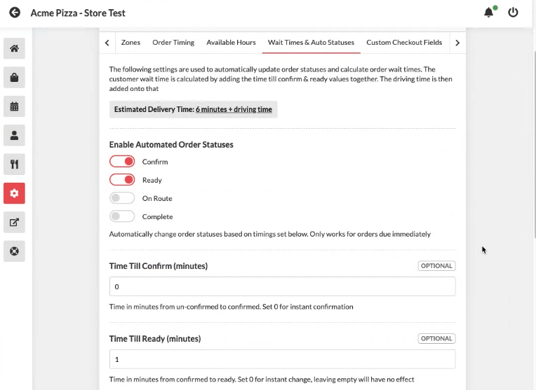

# So integrieren Sie Postmates mit Restoflow

## POSTMATES-Integration


**In welchen Städten ist Postmates verfügbar?**

[Dies ist die aktualisierte Liste der Städte, in denen Postmates verfügbar ist](https://www.notion.so/restoflowwiki/POSTMATES-Integration-ca913853d3ad493eb935d2a5f1120c30#8f10f90feb7a4b94ab35dfdbe0b14158)


## So richten Sie die Restoflow > Postmates-Integration ein




1 - Melden Sie sich beim Postmates-Konto unter - partner.postmates.com an

2 – Klicken Sie auf Entwickler > Webhooks > Webhook erstellen

3 – Fügen Sie die API-URL in den Abschnitt „Webhooks“ für Produktion und Sandbox ein. Die API-URL für den Webhook finden Sie in Ihrem Restaurant-Dashboard unter Einstellungen > Integrationen > Postmates > Postmates-Webhook-URL




Stellen Sie zum Testen sicher, dass die „Wartezeiten und automatischen Status“ wie folgt eingestellt sind.

Bestätigen = Ein bei 0 Min

Bereit = Ein bei 0 Min




Nachfolgend finden Sie die Schlüssel in Postmates, die Sie verwenden müssen, wenn Sie die Shipday-Integrationseinstellungen im Restaurant hinzufügen (Einstellungen > Integrationen > Postmates);

* Sandbox-Schlüssel (Authentifizierungsschlüssel zum Testen)
* Produktionsschlüssel (Authentifizierungsschlüssel für Live)
* Kundennummer
* Signaturgeheimnis

Fügen Sie die Werte aus Ihrem Postmates-Konto wie unten beschrieben hinzu (Einstellungen > Integrationen > Postmates);




Die Postkollegen werden während des Bezahlvorgangs angezeigt.

Postmates-Lieferungen werden auf dem Dashboard mit dem Postmates-Logo angezeigt.




## **Postmates-Konto erstellen**

Das Hinzufügen von Postmates als Lieferservice ist einfach und trägt dazu bei, Ihren Umsatz mit Kunden zu steigern, die eine Lieferung direkt an ihre Haustür wünschen.

**Einrichten des Kontos und der Zahlungsmethode**

Sie müssen zunächst ein Postmates-Entwicklerkonto erstellen, das Sie unter diesem Link finden: [https://postmates.com/developer](https://postmates.com/developer)

Sobald Sie Ihre Restaurantinformationen eingegeben haben, werden Sie zum Postmates-Dashboard weitergeleitet. Um die von uns benötigten Postmates-Informationen zu erhalten, müssen Sie eine Zahlungsmethode angeben, damit Postmates diese nach Abschluss einer Bestellung belasten kann. Klicken Sie dazu auf „Zahlungskarte hinzufügen“, geben Sie Ihre Kreditkarteninformationen ein und klicken Sie auf „Speichern“. Nachdem Sie nun Ihre Kreditkarteninformationen eingegeben haben, werden auf dem Bildschirm verschiedene „Schlüssel“ angezeigt.

## WESENTLICHE EINSTELLUNGEN


WICHTIG – Die folgenden Einstellungen müssen angewendet werden, damit die Postmates-Integration funktioniert.


**In Restoflow müssen die folgenden Einstellungen angewendet werden;**

1\. Generieren Sie den Webhook und fügen Sie ihn zu Postmates hinzu (Details oben).

2\. Fügen Sie die Postmates-Schlüssel zum Restaurant-Dashboard hinzu. Einstellungen > Integrationen > Postmates.

3\. Einstellungen > Dienste > Lieferungen > Gebühren > Keine

4\. Einstellungen > Dienste > Lieferungen > Allgemein > Standard-Lieferanbieter = Postmates

5\. Einstellungen > Dienste > Lieferungen > Wartezeiten und automatische Status

Die folgenden Einstellungen MÜSSEN aktiviert sein;

* Zeit bis zur Bestätigung (Minuten)
* Zeit bis zur Fertigstellung (Minuten)
* Zeit bis zur Route (Minuten)

Hinweis: Sie können für diese Felder unterschiedliche Zeiten festlegen und die anderen Felder in diesem Abschnitt verwenden, dies hat jedoch keine Auswirkungen auf die Postmates-Integration.

## FAQ

* **Was ist, wenn ich bereits ein Postmates-Konto habe und deren App verwende? Benötige ich weiterhin ein Entwicklerkonto?**

Sie sollten bereits Zugriff auf den Entwicklerbereich von Postmates haben und müssen lediglich die vorhandenen Schlüssel in das Restoflow Admin Dashboard kopieren.
